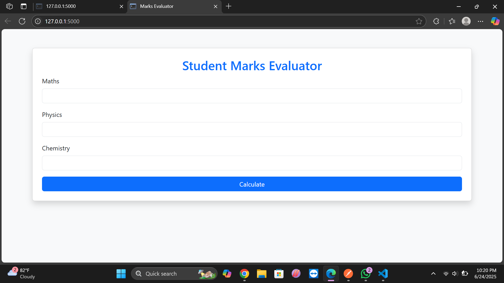

# 🎓 Student Marks Evaluator – Flask Web App

A simple web application built with Flask that lets users input marks for **Maths**, **Physics**, and **Chemistry**, then calculates the average and determines whether the student has **passed or failed**.

## 🚀 Features

- 🎯 User form to input 3 subject marks
- 📊 Calculates average marks
- ✅ Displays "Pass" if average ≥ 40, else "Fail"
- 📡 Includes a JSON API endpoint (`/api`) to add two numbers
- 🎨 Responsive design using HTML + Bootstrap


## 📸 Screenshot

> *(Add a screenshot here by naming it `screenshot.png` and placing it in the root folder)*




## Folder Structure
Student-Marks-Evaluator/
│
├── app.py
├── templates/
│ └── form.html
├── .gitignore
├── README.md
└── env/ (excluded from Git)

## 💻 How to Run Locally

1. **Clone the repository**
```
git clone https://github.com/alekya34/Student-Marks-Evaluator.git
cd Student-Marks-Evaluator
```

2. **Create and activate a virtual environment**
```
python -m venv env
env\Scripts\activate   # Windows
source env/bin/activate   # macOS/Linux
```

3. **Install Flask**
```
pip install flask
```

4. **Run the Flask app**
```
python app.py
```

Then open your browser and go to: [http://localhost:5000](http://localhost:5000)
🧪 API Endpoint
POST /api

Request JSON:
{
  "a": 10,
  "b": 20
}
Response JSON:
{
  "result": 30.0
}

🛠️ Technologies Used
Python
Flask
HTML5
Bootstrap
JSON API
